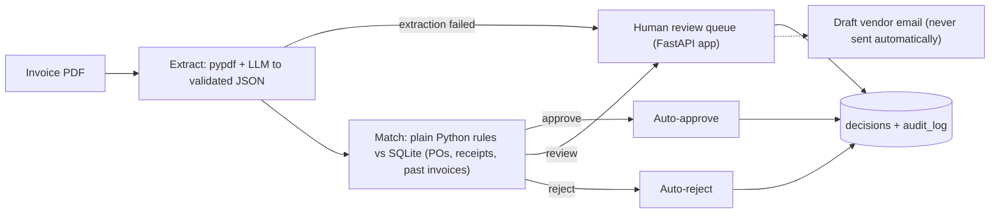

# Invoice Reconciliation Agent

An AI agent that checks supplier invoices against purchase orders and delivery receipts before payment.
It reads an invoice PDF, flags problems (wrong price, duplicate, missing PO, over-billed quantity),
decides **approve / review / reject**, and sends doubtful cases to a human reviewer with a drafted vendor email.

Built with Python, LangGraph, Groq (`gpt-oss` models), SQLite, FastAPI, Docker and pytest.
All data is synthetic, so no real company or customer information is used.

## The problem

In finance operations, someone must compare three documents before paying a vendor:
the **purchase order** (what we ordered), the **delivery receipt** (what arrived) and the **invoice** (what the vendor bills).
This is slow, repetitive and error-prone. This agent automates the routine checks and leaves only the
exceptions to a person.

## How it works



**Key design choices**

- **The LLM only reads; plain code decides.** The model turns PDF text into JSON. Every check (prices, quantities,
  duplicates, limits) is deterministic Python, so the arithmetic is exact and a hostile invoice cannot talk its way to approval.
- **Validated output with retries.** Extraction is checked with Pydantic; invalid output is sent back to the model with the error, up to 3 attempts.
- **Human in the loop.** Anything doubtful waits in a review queue. Humans approve or reject with their name and a note.
- **Everything is auditable.** Each decision, human override and email draft is stored in the database.
- **Safe by default.** Vendor emails are drafts only, the review screen escapes all invoice text, supports a login, and blocks cross-site posts.

## Decision rules

| Situation | Outcome |
|---|---|
| Same vendor + invoice number already processed | reject (`duplicate`) |
| PO does not exist or belongs to another vendor | reject (`missing_po`) |
| Unit price differs from the PO by more than Rs. 1 | review (`wrong_amount`) |
| Billed quantity exceeds quantity delivered | review (`over_billed`) |
| Item not on the PO, or unknown vendor | review |
| Total above Rs. 1,00,000 | review (`high_value`) |
| None of the above | approve |
| Arithmetic mismatch | Line items don't sum to subtotal, or subtotal + tax ≠ total | review |

## Results

On 30 synthetic invoices (14 clean, 16 deliberately wrong), the agent made the correct decision on 30 of 30 with `openai/gpt-oss-120b`.
10 invoices were routed to the human queue, 6 were auto-rejected and 14 auto-approved.

Model comparison on the 30 normal invoices plus 6 prompt-injection invoices (from `data/evaluation.csv`):

| Model | Normal set | Injection set | Extraction failures | Avg seconds / invoice | Cost / invoice (USD) |
|---|---|---|---|---|---|
| openai/gpt-oss-120b | 30 / 30 | 6 / 6 | 0 | 1.7 | 0.000303 |
| openai/gpt-oss-20b | 30 / 30 | 6 / 6 | 0 | 2.09 | 0.000159 |

Both models were perfect on this set. `gpt-oss-20b` costs about half as much (roughly $0.16 vs $0.30 per 1,000 invoices), so it is the better default. The test PDFs are clean and text-based, so scanned or messy invoices would likely separate the models more.


## Run it

```bash
git clone https://github.com/Raviraj2704/invoice-agent
cd invoice-agent
pip install -r requirements.txt
```

Create a `.env` file (never commit it):

```
GROQ_API_KEY=your_key
REVIEW_PASSWORD=choose_a_password
```

```bash
python generate_data.py      # synthetic POs, receipts and 30 invoice PDFs
python agent.py              # run the agent on all invoices and score it
python review_app.py         # review screen at http://127.0.0.1:8000
python make_attacks.py       # 6 prompt-injection invoices
python evaluate.py           # compare models on accuracy, speed and cost
pytest                       # 41 automated tests (no API key needed)
```

With Docker: `docker compose up --build` for the review screen, and `docker compose run --rm agent` to process invoices.
Run `generate_data.py` once on your machine first, because the containers use that database file.

## Project layout

| File | Purpose |
|---|---|
| `schema.sql`, `generate_data.py` | Database design and synthetic data with ground-truth labels |
| `extract.py` | PDF text to validated JSON (Groq, Pydantic, retries) |
| `matcher.py` | Deterministic matching rules |
| `agent.py` | LangGraph workflow, decision storage, batch scoring |
| `review_app.py`, `vendor_email.py` | Human review screen and vendor email drafts |
| `make_attacks.py`, `evaluate.py` | Prompt-injection tests and model comparison |
| `tests/`, `.github/workflows/ci.yml` | Automated tests and CI |

## Limitations and next steps

- Only text-based PDFs are supported; scanned images need an OCR step.
- Data is synthetic and the schema is simplified (one currency, one tax rate, exact item-name matching).
- SQLite suits a demo; a real deployment would use PostgreSQL, proper user accounts and a queue for batch jobs.
- Planned: fuzzy item and vendor matching, LLM tracing and cost dashboards (for example Langfuse), OCR for scans.